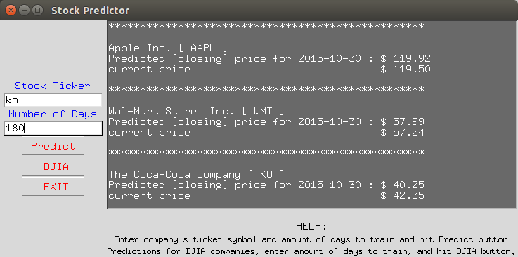

### Stock Predictor using machine learning

Stock Predictor is a stock price prediction program written in python. Stock prediction uses Yahoo finance to get required data and make predictions using support vector machine provided in SKlearn.

To run the program:

	Using GUI:
	
		cd into AI-Project/Predictor
		
                python predictor_gui.py
                
                  Use the window to make predictions
                  
	Using Shell
	
	        cd into AI-Project/Predictor
	        
			    python predictor.py <ticker> <number_of_days>
			
			    python predictor.py (-h || --help) (to see more)
			

Dependency:

  Python 2.7
  
  yahoo_finance
  
  sklearn
  
  docopt
  
  Tkinter
  
  numpy
  
  pandas
  
  (See dependency.txt for more information)
  
  

Machine learning techniques:  
  1. Support Vector Machine

Markets Covered:

All the markets covered by yahoo finance will be covered by this program.

Contributors:

  Prakash Dhimal  @pdhimal1
  
  Kevin Sanford
