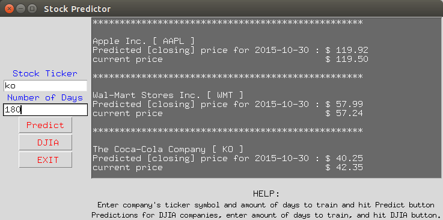

# 📈 Stock Predictor

A beautiful, user-friendly stock price prediction application powered by Machine Learning.



## ✨ What's New in Version 2.0

- 🎨 **Sleek Modern UI** - Dark theme with beautiful cards and smooth animations
- 🔍 **Smart Autocomplete** - Search stocks as you type with 100+ popular tickers
- 📅 **Smart Date Detection** - Automatically predicts for the next trading day (handles weekends & holidays)
- 📊 **Interactive Charts** - Beautiful dark-themed price charts with moving averages
- ⚡ **Async Predictions** - UI stays responsive during predictions
- 🎯 **Easy One-Click Launch** - Run with a simple double-click

## 🚀 Quick Start (Super Easy!)

### Windows Users
1. Double-click **`Run_Stock_Predictor.bat`**
2. Done! The app opens automatically

### Mac/Linux Users  
1. Open Terminal
2. Navigate to the project folder
3. Run: `bash run_stock_predictor.sh`

### Need to Install First?
```bash
pip install -r requirements.txt
```

## 📖 How to Use

### 1. Enter a Stock Ticker
- Start typing in the "Stock Ticker Symbol" field
- Watch the autocomplete dropdown suggest stocks
- Click on a suggestion or press Enter

**Popular Examples:**
- Type "AAPL" → Apple Inc.
- Type "MSFT" → Microsoft Corporation
- Type "TSLA" → Tesla Inc.

### 2. Choose Training Days
Select how many days of historical data to use:
- **10 days** - Quick prediction
- **30 days** - Recommended (best balance)
- **60-90 days** - More accurate but slower

### 3. Select Features (Optional)
- ✓ **Include Price Change** - Recommended for better accuracy
- ☐ **Include Trading Volume** - Adds volume data to prediction

### 4. Click "Predict Price"
Wait a few seconds and see:
- ✅ Predicted closing price for the **next trading day**
- ✅ Current market price
- ✅ Visual chart of 90-day price history
- ✅ 20-day moving average line

### 5. Predict DJIA (Optional)
Click "📊 Predict All DJIA" to predict prices for all 30 Dow Jones stocks at once!

## 🎯 Popular Stock Tickers

| Ticker | Company | Sector |
|--------|---------|--------|
| **AAPL** | Apple Inc. | Technology |
| **MSFT** | Microsoft | Technology |
| **GOOGL** | Alphabet (Google) | Technology |
| **AMZN** | Amazon.com | Consumer |
| **TSLA** | Tesla Inc. | Automotive |
| **META** | Meta (Facebook) | Technology |
| **NVDA** | NVIDIA | Semiconductors |
| **NFLX** | Netflix | Entertainment |
| **AMD** | AMD | Semiconductors |
| **DIS** | Disney | Entertainment |

**💡 Tip:** Type any company name in the search field - if it's in our database of 100+ stocks, it will appear automatically!

## 📋 System Requirements

- **Python 3.8** or higher
- **Internet connection** (for real-time stock data)
- **Any modern computer** (Windows, Mac, or Linux)

## 🔧 Installation

### Step 1: Install Python
Download and install Python 3.8+ from [python.org](https://python.org)

### Step 2: Install Dependencies
Open terminal/command prompt and run:
```bash
pip install -r requirements.txt
```

This installs:
- `yfinance` - Stock data from Yahoo Finance
- `scikit-learn` - Machine learning (SVM)
- `matplotlib` - Beautiful charts
- `numpy` - Math operations
- `pandas` - Data handling
- Plus other required packages

### Step 3: Launch the App
```bash
cd Predictor
python stock_predictor_gui.py
```

Or use the launcher scripts:
- **Windows**: Double-click `Run_Stock_Predictor.bat`
- **Mac/Linux**: `bash run_stock_predictor.sh`

## 🧠 How It Works

Our app uses **Support Vector Machine (SVM)**, a powerful machine learning algorithm:

1. **📥 Data Collection** - Fetches historical prices from Yahoo Finance
2. **🔧 Feature Engineering** - Analyzes opening price, daily high/low, price changes
3. **📊 Normalization** - Scales data for optimal ML performance
4. **🎓 Training** - SVM learns patterns from historical data
5. **🔮 Prediction** - Forecasts the next trading day's closing price
6. **📅 Smart Scheduling** - Automatically accounts for weekends and market holidays

### Machine Learning Features
- **Algorithm**: Support Vector Regression (SVR)
- **Features**: Open, High, Low prices + optional Volume & Price Change
- **Training**: RBF Kernel with optimized hyperparameters

## 🛠️ Troubleshooting

### App Won't Open?
**Problem:** Dependencies not installed
**Solution:**
```bash
pip install -r requirements.txt
```

### "No Data Found" Error?
**Possible Causes:**
- Market is closed (weekend/holiday)
- Invalid ticker symbol
- Internet connection issue

**Solutions:**
- Check your internet connection
- Verify the ticker on [finance.yahoo.com](https://finance.yahoo.com)
- Try a different stock

### Charts Not Showing?
**Solution:**
```bash
pip install matplotlib
```

### Predictions Seem Wrong?
**Remember:**
- Stock predictions are probabilistic, not guaranteed
- Market conditions change rapidly
- Use as a learning tool, not investment advice

## 📊 Version History

### Version 2.0 (Current) - February 2025
**Major Update:**
- 🎨 Brand new dark-themed modern UI
- 🔍 Autocomplete with 100+ stock tickers
- 📅 Smart next-trading-day prediction (handles weekends/holidays)
- 📊 Improved charts with better styling
- ⚡ Async processing for responsive UI
- 🖥️ High DPI support for crisp text
- 📦 Easy launcher scripts (.bat & .sh)

### Version 1.0 (Legacy)
- Basic command-line interface
- Python 2.7 support
- Text-only output
- Deprecated libraries

## 📁 Project Structure

```
AI-Project/
├── Predictor/
│   ├── stock_predictor_gui.py    # Main GUI application
│   ├── predictor.py              # Core prediction logic
│   ├── trading_day.py            # Trading day calculations
│   ├── current_trading_day.py    # Trading data processing
│   ├── get_historical.py         # Historical data handler
│   ├── normalize.py              # Data normalization
│   └── company_name.py           # Company name lookups
├── Data/
│   ├── Stock.csv                 # Stock database
│   └── DJIA_ticker.csv           # DJIA tickers
├── Run_Stock_Predictor.bat       # Windows launcher
├── run_stock_predictor.sh        # Mac/Linux launcher
├── requirements.txt              # Python dependencies
└── README.md                     # This file
```

## 👥 Contributors

- **Prakash Dhimal** ([@pdhimal1](https://github.com/pdhimal1))
- **Kevin Sanford**

## 📄 License

See [LICENSE](LICENSE) file for details.

## ⚠️ Important Disclaimer

**This software is for educational purposes only.**

- Stock predictions are **never 100% accurate**
- Machine learning forecasts are based on historical patterns
- Past performance does not guarantee future results
- Always consult a qualified financial advisor before investing
- The authors are **not responsible** for any financial losses

**Remember:** Investing involves risk. Never invest money you cannot afford to lose.

---

## 💡 Tips for Best Results

1. **Use 30-day training** for most stocks (good balance)
2. **Enable "Include Price Change"** for better accuracy
3. **Try multiple stocks** to compare predictions
4. **Check the chart** - trends matter!
5. **Use during market hours** for most current data

**Happy Predicting! 📈🚀**

---

**Need Help?** Check the Quick Help section in the app, or look up any stock ticker on [finance.yahoo.com](https://finance.yahoo.com)
